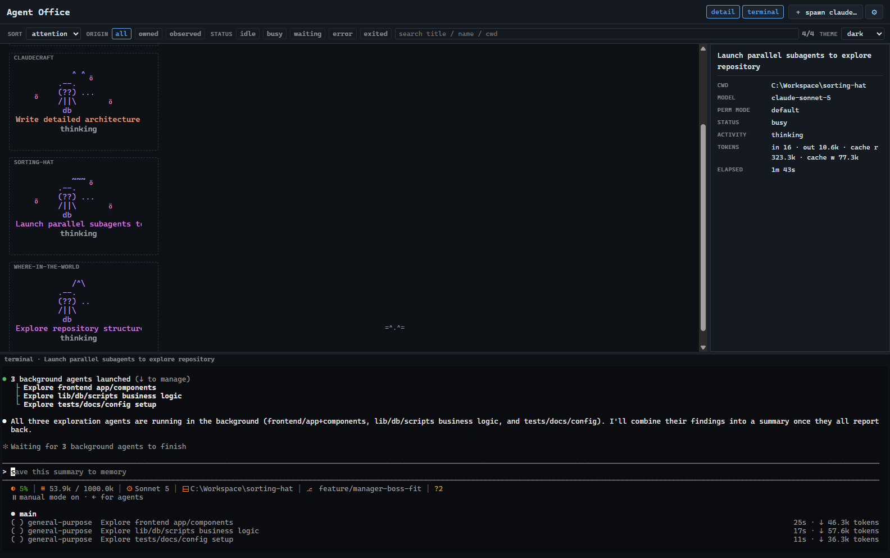
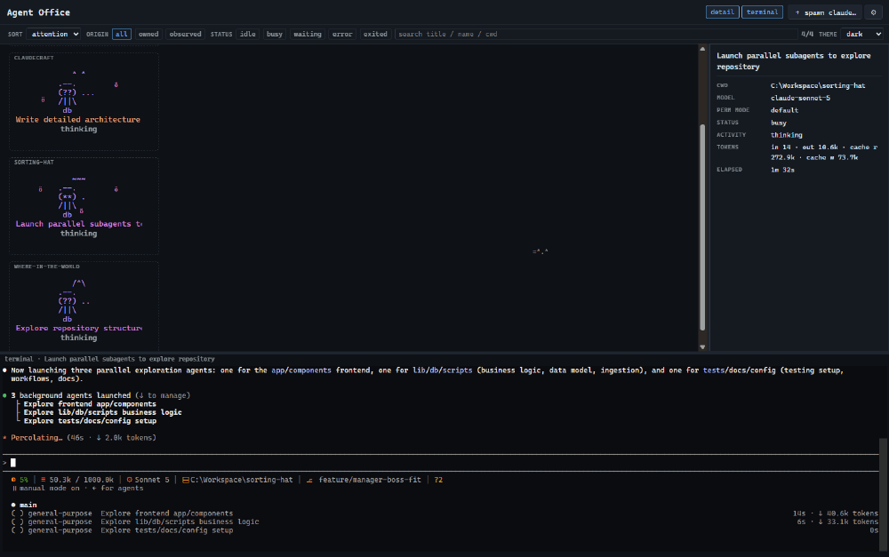

# Agent Office

**See and drive all your parallel Claude Code sessions at a glance — as a living ASCII office.**

Agent Office is a Windows desktop app that turns your running Claude Code
sessions into workers at desks in an office scene. See what every agent is
doing, get pulled in the moment one needs approval, and spawn, answer, or jump
to any session without hunting through terminal tabs.

It rides your existing Claude subscription — sessions run through the real
`claude` CLI you're already signed in to. **No API keys, no per-token billing.**

## Download

**[⬇ Download the latest release](https://github.com/evanx9/agent-office-release/releases/latest)**

- **Portable (recommended):** grab `agent-office-<version>-portable.exe` and run
  it — no installer.
- **Installer:** `agent-office-<version>-setup.exe` (per-user, one click).

Builds are code-signed (publisher **Evan Wee**). As a new publisher, Windows
SmartScreen may still show a "More info → Run anyway" prompt on early downloads
until reputation builds — this is expected and goes away over time.

## See it in action

## What it does

- **Never miss an approval.** A session waiting on you surfaces a quick-reply
  right in the scene — approve, deny, or type a response, with a guard on
  destructive commands.
- **See every session at once.** Each Claude Code session becomes a worker;
  agents on the same repo share a labeled room. Watch them think, read, edit,
  run commands, or wait.
- **Read the room at a glance.** Context-window pressure, subagent fan-out
  (minions!), idle vs. busy, and completion celebrations — all visible without
  opening a single terminal.
- **Drive from one window.** Spawn new sessions (folder, model, permission
  mode), jump into an embedded terminal with full history, rename workers, and
  kill sessions.
- **Reward good work.** Give a worker a "treat" — optionally saving the note to
  the project's CLAUDE.md so praise becomes a durable preference.
- **Made to delight.** An office that feels alive: an ambient cat, day-night
  ambience, seasonal visitors, themes, and CRT scanlines if you want them.

## Free to watch, licensed to drive

Agent Office is **free forever in observe-only mode** — watch and understand all
your sessions at no cost. A license key unlocks **driving** (spawning, replying,
adopting, reviews). Paste your key in **Settings** — verified fully offline and
remembered across launches.

> ### 🔑 Now in free private beta
> Agent Office is in **private beta**, and beta keys unlock **every drive
> feature, free**, through the beta.
> **[Request a beta key](mailto:legends.of.etma@gmail.com?subject=Agent%20Office%20beta%20access)**,
> then paste it in Settings to start driving.

## Requirements

- **Windows 10 (1809 / build 17763) or Windows 11, 64-bit.**
- **[Claude Code](https://claude.com/claude-code) installed and signed in**, with
  `claude` on your `PATH`. Agent Office is a dashboard *over* your existing
  sessions — it never touches the Anthropic API.
- *Optional:* [PowerShell 7](https://learn.microsoft.com/powershell/) for a
  nicer embedded terminal (falls back to the Windows PowerShell you already have).

---

*Agent Office is a Windows-native app in the spirit of Claude Code's "Claude
Buddy" easter egg. Binaries are published here; the source is maintained
privately.*
