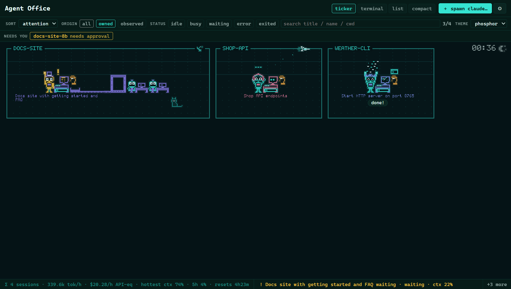
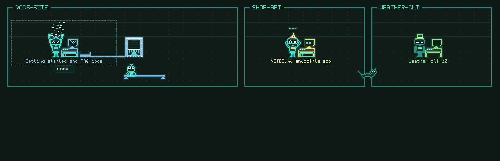

# Agent Office

**See and drive all your parallel Claude Code sessions at a glance — as a living pixel-art office.**

Agent Office is a Windows desktop app that turns your running Claude Code
sessions into little robots at desks in a pixel-art office. See what every agent is
doing, get pulled in the moment one needs approval, and spawn, answer, or jump
to any session without hunting through terminal tabs.

It rides your existing Claude subscription — sessions run through the real
`claude` CLI you're already signed in to. **No API keys, no per-token billing.**

## Download

**[⬇ Download the latest release](https://github.com/evanx9/agent-office-release/releases/latest)**

- **Portable (recommended):** grab `agent-office-<version>-portable.exe` and run
  it — no installer.
- **Installer:** `agent-office-<version>-setup.exe` (per-user, one click).

Builds are code-signed (publisher **Evan Wee**). As a new publisher, Windows
SmartScreen may still show a "More info → Run anyway" prompt on early downloads
until reputation builds — this is expected and goes away over time.

## See it in action

## New in 1.0

- **A new pixel-art look.** Phosphor-lit robots in labelled rooms, and a
  system theme that follows your Windows accent colour. Prefer the original
  ASCII office? It's one setting away: Settings → **office look** → **ascii**.
- **Watch teams work.** Subagents appear as small copies of their session's
  robot and walk their results back. Sessions with a task list get a
  whiteboard.
- **Catch file clashes.** Two sessions editing the same file, even from
  different git worktrees, get flagged on both desks with one notification.
- **Spot stuck sessions.** A session re-running a failing command or going in
  circles is marked `?! stuck`, and clears as soon as it moves again.
- **Know what it costs.** A fleet total in the ticker (tokens/hour and
  API-equivalent $/hour), today / yesterday / last 7 days, and on Pro/Max a
  forecast of when your 5-hour window runs out.

## What it does

- **Never miss an approval.** A session waiting on you surfaces a quick-reply
  right in the scene — approve, deny, or type a response, with a guard on
  destructive commands.
- **See every session at once.** Each Claude Code session becomes a worker;
  agents on the same repo share a labeled room. Watch them think, read, edit,
  run commands, or wait.
- **Read the room at a glance.** Context-window pressure, subagent fan-out
  (minions!), idle vs. busy, and completion celebrations — all visible without
  opening a single terminal.
- **A calm one-line ticker.** Every session in a strip under the office, the
  ones that need you first. It stays still until something changes; select a
  worker to see its model, context, tokens and elapsed time.
- **Drive from one window.** Spawn new sessions (folder, model, permission
  mode), jump into an embedded terminal with full history, rename workers, and
  kill sessions.
- **Reward good work.** Give a worker a "treat" — optionally saving the note to
  the project's CLAUDE.md so praise becomes a durable preference.
- **Made to delight.** An office that feels alive: an ambient cat, day-night
  ambience, seasonal visitors, themes, and CRT scanlines if you want them. In
  both the pixel and the ASCII office.

## Free

Agent Office is **free** — watching and driving (spawning, replying, adopting,
reviews) alike. No licence key, account or sign-up.

## Requirements

- **Windows 10 (1809 / build 17763) or Windows 11, 64-bit.**
- **[Claude Code](https://claude.com/claude-code) installed and signed in**, with
  `claude` on your `PATH`. Agent Office is a dashboard *over* your existing
  sessions — it never touches the Anthropic API.
- *Optional:* [PowerShell 7](https://learn.microsoft.com/powershell/) for a
  nicer embedded terminal (falls back to the Windows PowerShell you already have).

---

*Agent Office is a Windows-native app in the spirit of Claude Code's "Claude
Buddy" easter egg. Binaries are published here; the source is maintained
privately.*
