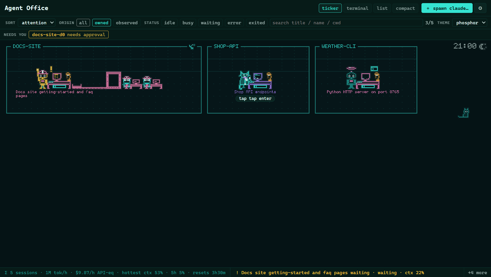
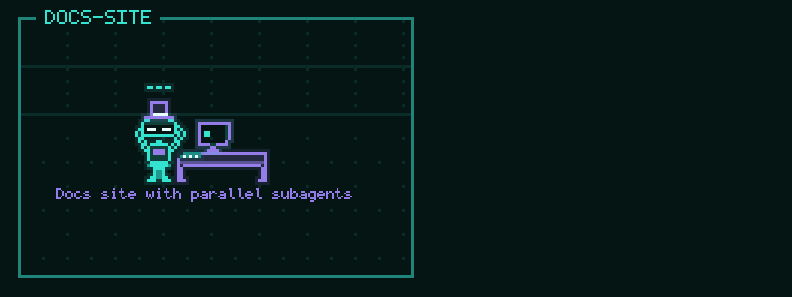
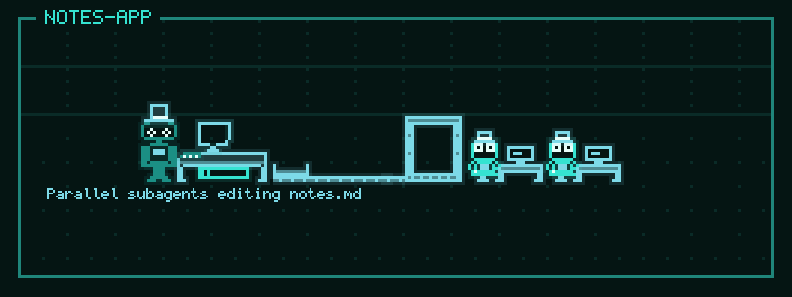
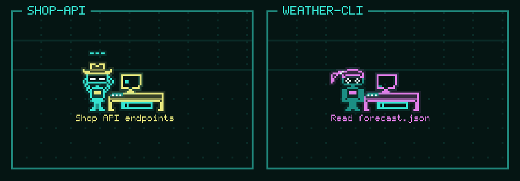
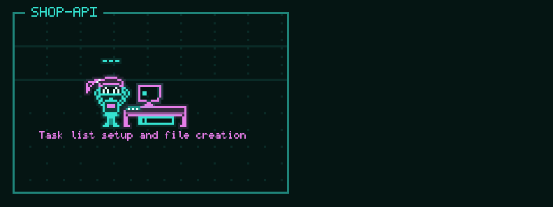
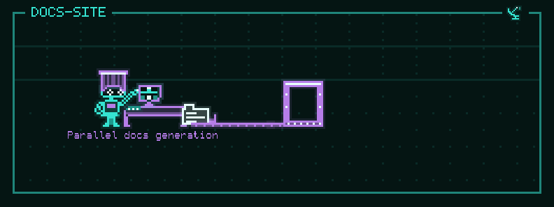
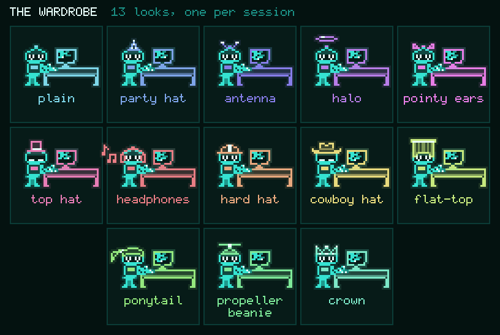
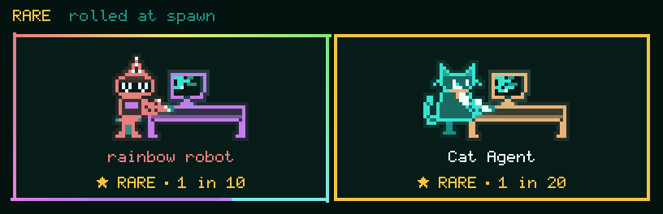
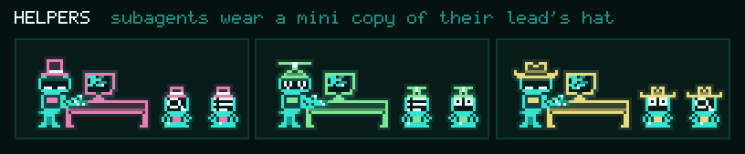

# Agent Office

**See and drive all your parallel Claude Code sessions at a glance — as a living pixel-art office.**

Agent Office is a Windows desktop app that turns your running Claude Code
sessions into little robots at desks in a pixel-art office. See what every agent is
doing, get pulled in the moment one needs approval, and spawn, answer, or jump
to any session without hunting through terminal tabs.

It rides your existing Claude subscription — sessions run through the real
`claude` CLI you're already signed in to. **No API keys, no per-token billing.**

## Download

**[⬇ Download the latest release](https://github.com/evanx9/agent-office-release/releases/latest)**

- **Portable (recommended):** grab `agent-office-<version>-portable.exe` and run
  it — no installer.
- **Installer:** `agent-office-<version>-setup.exe` (per-user, one click).

Builds are code-signed (publisher **Evan Wee**). As a new publisher, Windows
SmartScreen may still show a "More info → Run anyway" prompt on early downloads
until reputation builds — this is expected and goes away over time.

## Watch the office come alive

Agent Office isn't a dashboard of rows and percentages. Every session is a
robot with a desk, and what Claude is actually doing shows up as something
you can watch. You can read the room from across your monitor, and the small
stuff makes it fun to leave open.

### A session calls in helpers

When Claude hands work to subagents, a fabricator next to the desk builds
each helper robot, and they walk over to a bench of mini desks. Each helper
wears a small copy of its lead's hat, so you can see whose helpers are whose.
Hover one to see the job it was given. When it's done it walks the result
back to the lead's in-tray and powers down.

### Helpers sharing a file

Two helpers editing the same file meet at a shared table in the team's room.
That's teamwork and it's drawn in calm teal. When two separate *sessions*
touch the same file (even from different git worktrees), it's a clash
instead: both desks are flagged in gold and you get one notification, before
it turns into a merge conflict.

### Sessions passing notes

When one session messages another, even in a different repo, a paper
airplane flies from the sender's room to the receiver's. The landing bubble
says who it's from, and the two robots trade a line ("airmail!" / "nice
landing").

### One whiteboard, many streams

A session with a task list gets a whiteboard beside its desk. Items move from
to-do to doing to done as the work happens, so you can follow several streams
of work at once without opening a terminal. When the list is finished the room tidies up
a few minutes later.

### Office chatter, with a dish on the roof

Now and then a robot says what it's up to: "grep grep grep" while
searching, "fingers crossed" while tests run, "brb, coffee" during a
compaction. Leads and helpers talk to each other ("a job for you!" /
"ooh, a job!"). The lines are built into the app, so chatter costs no tokens,
and it never covers a robot that needs you. Driving a session from claude.ai
or your phone with `/remote-control`? Its room gets a satellite dish on the
roof.

### And the little things

- **A cat on the floor.** The office cat wanders between desks while
  anyone's working, and curls up for a nap when everyone's idle.
- **Day and night.** The clock in the corner shows a sunrise, sun, sunset or
  moon, and the desk lamps come on in the evening.
- **Seasonal visitors.** Mascots drop by with greetings on New Year's,
  Easter, Halloween and Christmas. April Fools brings a swarm of Claude
  Buddies.
- **Celebrations and treats.** A robot celebrates when it finishes a job.
  Give it a treat with a note, and the note can be saved to the project's
  `CLAUDE.md` so the praise sticks.
- **Hard-to-miss signals.** A robot that needs your approval says so over
  its desk. A session going in circles shows `?! stuck`. A background command
  still running leaves a small blinking terminal on the desk.

## Meet the crew

Every session gets its own robot, with an accent colour and one item from the
wardrobe: party hat, antenna, halo, pointy ears, top hat, headphones, hard hat,
cowboy hat, flat-top, ponytail, propeller beanie (it spins), a crown, or
nothing at all. The look comes from the session, so a robot keeps it for as
long as the session lives, including across app restarts.

**Rare robots.** About one robot in ten comes out **rainbow**, and about one
in twenty is a **Cat Agent**: a cat at the keyboard, too dignified for hats.
Start a session and see who turns up.

## New in 1.4.0

- **Your robot stays your robot.** When you start a session from the app, the
  robot that walks in (hat, colour, and a rare rainbow or Cat Agent) is the
  one you keep. Before, it could turn into a different robot once the session
  finished loading. It also keeps that look after you restart the app.
- **Pixel art only.** The ASCII office is gone, along with the look switch in
  Settings. If you had it selected, the app opens in pixel art and keeps the
  rest of your settings. Every robot keeps the hat and colour it had before.

## New in 1.3.1

- **Drag the approval card.** The card that opens under a waiting session's
  desk can be dragged by its title bar, and it stops at the edge of the office
  so it can't get lost off-screen.
- **Long speech bubbles wrap.** A long line, like a message from another
  session, wraps to fit its room instead of running off the screen.
- **Small fixes.** The scroll bar no longer cuts into the clock, and the
  lead's ponytail hangs to the less crowded side of the desk.

## New in 1.3

- **Office chatter.** Now and then a worker says something about what it's
  doing in a speech bubble ("fingers crossed" while tests run, "brb, coffee"
  during a compaction), and helper robots answer their lead. It's occasional,
  never covers a "need you!", and costs no tokens: the lines are built in.
  Settings → office → **office chatter** → **off** silences it.
- **A bigger wardrobe.** New hats, from a hard hat and a cowboy hat to a crown
  and a propeller beanie whose propeller spins. Helper robots wear a mini copy
  of their lead's hat, so you can tell whose helpers are whose, and headphones
  give off the odd music note.
- **Rare robots.** About one worker in ten is a rainbow robot, and one in
  twenty is a Cat Agent: a cat at the keyboard, too dignified for hats.
- **And more.** The desk is longer, so the night lamp stands on it, and
  Settings is split into office, sessions and data tabs.
- **The ASCII office is deprecated.** New looks come to the pixel office only.
  (It was removed in 1.4.0.)

## New in 1.2

- **Paper airplanes between sessions.** When one session messages another,
  even in a different repo, a paper airplane flies from the sender's room to
  the receiver's, and the landing bubble says who it's from.
- **Rooms tidy up after themselves.** A room widens for helper robots and task
  boards, and now gives the space back: a minute after the last helper leaves,
  and five minutes after a task list is finished, so you have time to read it.
- **A pixel-art clock.** The top-right clock is drawn in the pixel font, with a
  sunrise, sun, sunset or moon for the time of day.

## New in 1.1

- **See background work.** When Claude starts a command in the background (a
  dev server, a long build), a small terminal with a blinking cursor sits by
  that desk until it finishes, so a session that looks idle but isn't is easy
  to spot.
- **A satellite dish for Remote Control.** Driving a session from claude.ai or
  your phone with `/remote-control`? Its room gets a dish on the roof. Hover it
  to see which session.
- **Permission mode for every session.** The ticker now shows `auto`,
  `acceptEdits`, `plan` or `default` for sessions you started in your own
  terminal too, which explains a session that ran something without asking.
- **Know what each helper is doing.** Hovering a subagent robot shows the task
  it was given, not just its type.

## New in 1.0

- **A new pixel-art look.** Phosphor-lit robots in labelled rooms, and a
  system theme that follows your Windows accent colour. (The original ASCII
  office stayed available as a setting until 1.4.0.)
- **Watch teams work.** Subagents appear as small copies of their session's
  robot and walk their results back. Sessions with a task list get a
  whiteboard.
- **Catch file clashes.** Two sessions editing the same file, even from
  different git worktrees, get flagged on both desks with one notification.
- **Spot stuck sessions.** A session re-running a failing command or going in
  circles is marked `?! stuck`, and clears as soon as it moves again.
- **Know what it costs.** A fleet total in the ticker (tokens/hour and
  API-equivalent $/hour), today / yesterday / last 7 days, and on Pro/Max a
  forecast of when your 5-hour window runs out.

## What it does

- **Never miss an approval.** A session waiting on you surfaces a quick-reply
  right in the scene — approve, deny, or type a response, with a guard on
  destructive commands. Drag it aside if it's in the way.
- **See every session at once.** Each Claude Code session becomes a worker;
  agents on the same repo share a labeled room. Watch them think, read, edit,
  run commands, or wait.
- **Read the room at a glance.** Context-window pressure, subagent fan-out
  (minions!), idle vs. busy, and completion celebrations — all visible without
  opening a single terminal.
- **A calm one-line ticker.** Every session in a strip under the office, the
  ones that need you first. It stays still until something changes; select a
  worker to see its model, context, tokens and elapsed time.
- **Drive from one window.** Spawn new sessions (folder, model, permission
  mode), jump into an embedded terminal with full history, rename workers, and
  kill sessions.
- **Reward good work.** Give a worker a "treat" — optionally saving the note to
  the project's CLAUDE.md so praise becomes a durable preference.
- **Made to delight.** An office that feels alive: an ambient cat, day-night
  ambience, seasonal visitors, themes, and CRT scanlines if you want them.

## Free

Agent Office is **free** — watching and driving (spawning, replying, adopting,
reviews) alike. No licence key, account or sign-up.

## Requirements

- **Windows 10 (1809 / build 17763) or Windows 11, 64-bit.**
- **[Claude Code](https://claude.com/claude-code) installed and signed in**, with
  `claude` on your `PATH`. Agent Office is a dashboard *over* your existing
  sessions — it never touches the Anthropic API.
- *Optional:* [PowerShell 7](https://learn.microsoft.com/powershell/) for a
  nicer embedded terminal (falls back to the Windows PowerShell you already have).

---

*Agent Office is a Windows-native app in the spirit of Claude Code's "Claude
Buddy" easter egg. Binaries are published here; the source is maintained
privately.*
